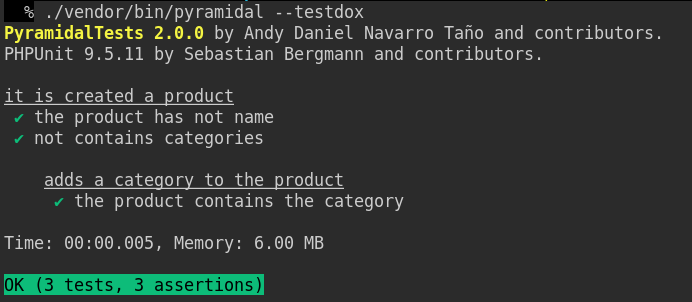

<h1 align="center">▴ PyramidalTests</h1>

### Extends the PHPUnit possibilities to the BDD field.

#### If you like this project gift us a ⭐.

## Documentation.

- [English](doc/en/index.md)
- [Español](doc/es/index.md)

## Installation.

    $ composer require --dev thenlabs/pyramidal-tests 2.0.x-dev

>This project is still under development.

## Example:

```php
<?php
// tests/test-it-is-created-a-product.php

testCase('it is created a product', function () {
    setUp(function () {
        $this->product = new Product();
    });

    test('the product has not name', function () {
        $this->assertEmpty($this->product->getName());
    });

    test('not contains categories', function () {
        $this->assertCount(0, $this->product->getCategories());
    });

    testCase('adds a category to the product', function () {
        setUp(function () {
            $this->category = $this->createMock(Category::class);
            $this->product->addCategory($this->category);
        });

        test('the product contains the category', function () {
            $this->assertContains($this->category, $this->product->getCategories());
        });
    });
});
```

## Executing:

    $ ./vendor/bin/pyramidal --testdox

>The `--testdox` argument is optional.

## Result:



## Development.

### Running the tests.

    $ composer test
