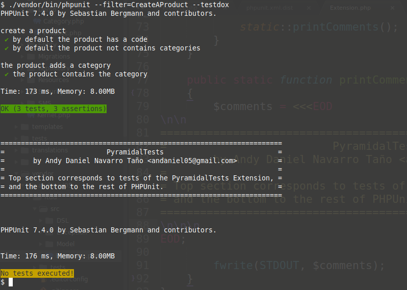

# PyramidalTests

PyramidalTests is a [PHPUnit](https://phpunit.de/) extension that allows you to create test cases by using anonymous functions. His philosophy is inspired by projects such as [mochajs] [1], [jasmine] [2], [peridotphp] [3], etc.


[1]: https://mochajs.org/
[2]: https://jasmine.github.io/
[3]: http://peridot-php.github.io/

>To understand the work with this extension it is necessary that you have knowledge about [PHPUnit] (https://phpunit.de/) and software testing in general, where ideally you should also have knowledge of any of the frameworks mentioned above .

Its main objective is to extend the applications of [PHPUnit] (https://phpunit.de/) to the [BDD] field (https://en.wikipedia.org/wiki/Behavior-driven_development). In addition to this, another of its objectives is to facilitate the creation of test cases offering certain advantages such as the reuse of tests.

>You can clone and modify the project [PyramidalTests-Demo] (https://github.com/andaniel05/PyramidalTests-Demo). It contains already implemented all the features shown here.

## Setup.

### 1. Installing with Composer.

    $ composer require andaniel05/pyramidaltests dev-master

### 2. Declaring extension in configuration file.

Add the next statement to `phpunit.xml` or equivalent.

```xml
    <extensions>
        <extension class="Andaniel05\PyramidalTests\Extension"></extension>
    </extensions>
```

### 3. DSL declaration.

In the `bootstrap.php` file or equivalent include the reference to `/vendor/andaniel05/pyramidaltests/src/DSL/PHPUnit.php`.

```php
<?php

require_once __DIR__ . '/vendor/autoload.php';
require_once __DIR__ . '/vendor/andaniel05/pyramidaltests/src/DSL/PHPUnit.php'; // DSL

// ...
```

>Use this file as as a template if you want to create a custom DSL.

## Knowing the philosophy.

The following code fragment corresponds to a test file showing the development philosophy.

```php

setTestCaseNamespace('Andaniel05\PyramidalTests\Demo\Tests');
setTestCaseClass('PHPUnit\Framework\TestCase');

use Andaniel05\PyramidalTests\Demo\Product;
use Andaniel05\PyramidalTests\Demo\Category;

testCase('create a product', function () {
    setUp(function () {
        $this->product = new Product;
    });

    test('by default the product has a code', function () {
        $this->assertNotEmpty($this->product->getCode());
    });

    test('by default the product not contains categories', function () {
        $this->assertCount(0, $this->product->getCategories());
    });

    testCase('the product adds a category', function () {
        setUp(function () {
            $this->category = new Category;
            $this->product->addCategory($this->category);
        });

        test('the product contains the category', function () {
            $this->assertContains($this->category, $this->product->getCategories());
        });
    });
});
```

As you can deduce, two test cases have been created to test the operation of the `Product` class.

You can see that they were created using the `testCase()` function, where their first argument corresponds to the description in natural language and the second with an anonymous function from which the members of the respective test case are defined.

In the same way that the `setUp ()` function is being used in the example, it is also possible to use the functions `setUpBeforeClass()`, `tearDown()` and `tearDownAfterClass()` where each of them is defined the respective behavior of the corresponding state.

To create the tests the `test()` function is used and, just like the `testCase()` function, it also receives a description as a first argument and the anonymous function with the test code as a second function.

One of the most important and powerful features of the extension is the nesting of test cases by calling the function `testCase()` from within the declaration of another. In this way what is done is to declare that the most internal inherits all the functionality of the most external but it is very important to mention that **the tests are not inherited**.

If you do not want any of the four state functions to inherit the parent's behavior then the word `false` must be specified as the second argument. Example:

```php
testCase(function () {
    setUp(function () {
        $this->name = 'Andy';
    });

    testCase(function () {
        setUp(function () {
            $this->lastname = 'Navarro';
        }, false);

        test(function () {
            $this->assertFalse(isset($this->name));
            $this->assertEquals('Navarro', $this->lastname);
        });
    });
});
```

As you can see also in the previous example, the descriptions in the `testCase ()` and `test ()` functions are completely optional. If they are omitted then **anonymous** tests and / or cases will be created.

It is highly recommended that each test file define the namespace that the test cases defined in it must have, as well as its base class. These statements are made with the `setTestCaseNamespace()` and `setTestCaseClass()` functions, as you can see in the first example.

## Executing the tests.

Once [PHPUnit](https://phpunit.de/) is invoked all the defined tests will be executed as is shown in the next image.

    $ ./vendor/bin/phpunit --testdox



There is a block of text indicating that the upper section corresponds to the result of the execution of the tests of the extension, while the lower one with the rest of the tests written in the traditional way of [PHPUnit](https://phpunit.de/).

>The reason of existence of this division is because we have not found any event in the architecture of [PHPUnit] (https://phpunit.de/) that allows to add tests in the `TestRunner` by default.

In this way, the main objective of the extension is fulfilled, which is to expand the possibilities of the framework since the tests are written with a new style and can coexist with the traditional ones.

## Configuration options.

### Running only the extension tests.

If in your project you intend to write ALL the tests in the style of the extension then in your configuration file you must add the following environment variable:

```xml
<php>
    <env name="PYRAMIDAL_ONLY" value="1"></env>
</php>
```

This way when [PHPUnit](https://phpunit.de/) is executed the result will be displayed as follows.


### Specifying margins for nested evidence cases.

When PHPUnit is executed with the `--testdox` option, the nested test cases are shown with a default space of 4 spaces. If you want to specify the value of this margin then you must declare the environment variable `PYRAMIDAL_MARGIN` whose value will correspond to the number of desired spaces.

```xml
<php>
    <env name="PYRAMIDAL_MARGIN" value="8"></env>
</php>
```

Contact me @andaniel05 and let me know what you think.
