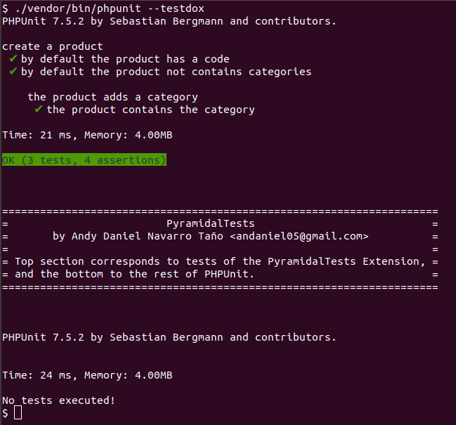
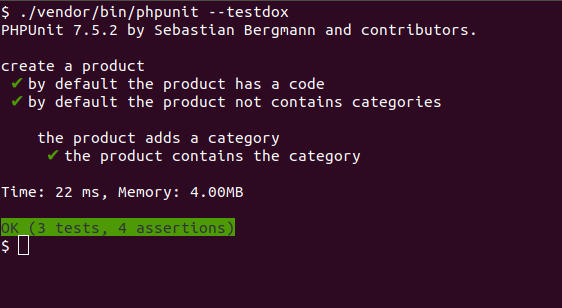

# PyramidalTests

PyramidalTests es una extensión para [PHPUnit](https://phpunit.de/) que permite crear los casos de prueba así como sus partes mediante el empleo de funciones anónimas. Sus principales objetivos son el de simplificar la creación de casos de prueba complejos además de extender las aplicaciones de [PHPUnit](https://phpunit.de/) al campo [BDD](https://en.wikipedia.org/wiki/Behavior-driven_development).

Su filosofía de desarrollo está inspirada en proyectos como [mochajs][1], [jasmine][2], [peridotphp][3], etc.

[1]: https://mochajs.org/
[2]: https://jasmine.github.io/
[3]: http://peridot-php.github.io/

>Para comprender el trabajo con esta extensión es necesario que usted tenga conocimientos sobre [PHPUnit](https://phpunit.de/) y de las pruebas de software en general.

Para una rápida toma de contacto usted puede clonar y modificar el proyecto [PyramidalTests-Demo](https://github.com/andaniel05/PyramidalTests-Demo). El mismo contiene ya implementado todas las funcionalidades que aquí se muestran.

## Instalación.

### 1. Instalando con Composer.

    $ composer require andaniel05/pyramidaltests dev-master

### 2. Declarando la extensión en el archivo de configuración.

Agregue la siguiente declaración al archivo `phpunit.xml` o equivalente.

```xml
    <extensions>
        <extension class="Andaniel05\PyramidalTests\Extension"></extension>
    </extensions>
```

### 3. Declarando el DSL a usar.

En el archivo `bootstrap.php` o equivalente de su proyecto incluya una referencia al archivo `/vendor/andaniel05/pyramidaltests/src/DSL/PHPUnit.php`.

```php
<?php

require_once __DIR__ . '/vendor/autoload.php';
require_once __DIR__ . '/vendor/andaniel05/pyramidaltests/src/DSL/PHPUnit.php'; // DSL

// ...
```

>Si desea crear un DSL personalizado puede tomar este archivo como muestra.

## Conociendo la filosofía.

El siguiente código demostrativo se corresponde con un archivo de pruebas donde se muestra la filosofía de desarrollo.

```php
// tests/ProductTest.php

setTestCaseNamespace('Andaniel05\PyramidalTests\Demo\Tests');
setTestCaseClass('PHPUnit\Framework\TestCase');

use Andaniel05\PyramidalTests\Demo\Product;
use Andaniel05\PyramidalTests\Demo\Category;

testCase('create a product', function () {
    setUp(function () {
        $this->product = new Product;
    });

    test('by default the product has a code', function () {
        $this->assertNotEmpty($this->product->getCode());
    });

    test('by default the product not contains categories', function () {
        $this->assertCount(0, $this->product->getCategories());
    });

    testCase('the product adds a category', function () {
        createMethod('addACategory', function () {
            $this->category = new Category;
            $this->product->addCategory($this->category);
        });

        setUp(function () {
            $this->addACategory();
        });

        test('the product contains the category', function () {
            $this->assertContains($this->category, $this->product->getCategories());
        });
    });
});
```

Como puede deducir se han creado dos casos de prueba para probar el funcionamiento de la clase `Product`.

Puede ver que los mismos se han creado mediante la función `testCase()` donde su primer argumento se corresponde con la descripción en lenguaje natural y el segundo con una función anónima desde donde se definen los miembros del respectivo caso de prueba.

De igual manera a como en el ejemplo se está usando la función `setUp()`, es posible emplear además las funciones `setUpBeforeClass()`, `tearDown()` y `tearDownAfterClass()` donde con cada una de ellas se define el respectivo comportamiento del correspondiente estado.

Para la creación de las pruebas se emplea la función `test()`, donde en este caso, al igual que la función `testCase()` también recibe como primer argumento una descripción y como segundo la función anónima con el código de la prueba.

De esta misma manera es posible además definir métodos gracias a la función `createMethod()`. Si se desea definir un método estático entonces se puede emplear la función `createStaticMethod()`.

Una de las características más importantes y potentes de la extensión es la anidación de casos de prueba al llamar a la función `testCase()` desde dentro de la declaración de otro. De esta forma lo que se hace es declarar que el más interno hereda todo el código de las funciones `setUpBeforeClass()`, `setUp()`, `tearDown()`, `tearDownAfterClass()`, y métodos desde el padre pero las pruebas no serán heredadas.

Si no desea que alguna de las cuatro funciones de estado herede el comportamiento del padre entonces se debe especificar la palabra `false` como segundo argumento. Ejemplo:

```php
testCase(function () {
    setUp(function () {
        $this->name = 'Andy';
    });

    testCase(function () {
        setUp(function () {
            $this->lastname = 'Navarro';
        }, false);

        test(function () {
            $this->assertFalse(isset($this->name));
            $this->assertEquals('Navarro', $this->lastname);
        });
    });
});
```

Como puede ver también en el ejemplo anterior, las descripciones en las funciones `testCase()` y `test()` son totalmente opcionales. Si se omiten entonces se estarán creando pruebas y/o casos **anónimos**.

Es totalmente recomendable que cada archivo de pruebas defina el espacio de nombres que deben tener los casos de prueba definidos en el mismo, así como su clase base. Estas declaraciones se hacen con las funciones `setTestCaseNamespace()` y `setTestCaseClass()` tal y como puede ver en el primer ejemplo.

## Ejecutando las pruebas.

Una vez que [PHPUnit](https://phpunit.de/) sea invocado se ejecutarán todas las pruebas definidas de esta manera tal y como se muestra en la siguiente imagen.

    $ ./vendor/bin/phpunit --testdox



Como puede ver existe un bloque de texto que indica que la sección superior se corresponde con el resultado de la ejecución de las pruebas de la extensión, mientras que la inferior con el resto de pruebas escritas en la manera tradicional de [PHPUnit](https://phpunit.de/).

>Queremos comentar que el motivo de existencia de esta división se debe a que no hemos encontrado ningún evento en la arquitectura de [PHPUnit](https://phpunit.de/) que permita agregar pruebas en el `TestRunner` por defecto.

De esta manera, se cumple con el principal objetivo de la extensión que es el de ampliar las posibilidades del framework ya que las pruebas de la extensión pueden coexistir con las tradicionales.

### Ejecutando solo las pruebas de la extensión.

Si en su proyecto pretende escribir TODAS las pruebas al estilo de la extensión entonces en su archivo de configuración usted puede agregar la siguiente variable de entorno:

```xml
<php>
    <env name="PYRAMIDAL_ONLY" value="1"></env>
</php>
```

De esta forma [PHPUnit](https://phpunit.de/) solo ejecutará las pruebas de la extensión y en los resultados no se mostrará el bloque informativo.



## Aspectos pendientes.

1. Traducir documentación al inglés.
